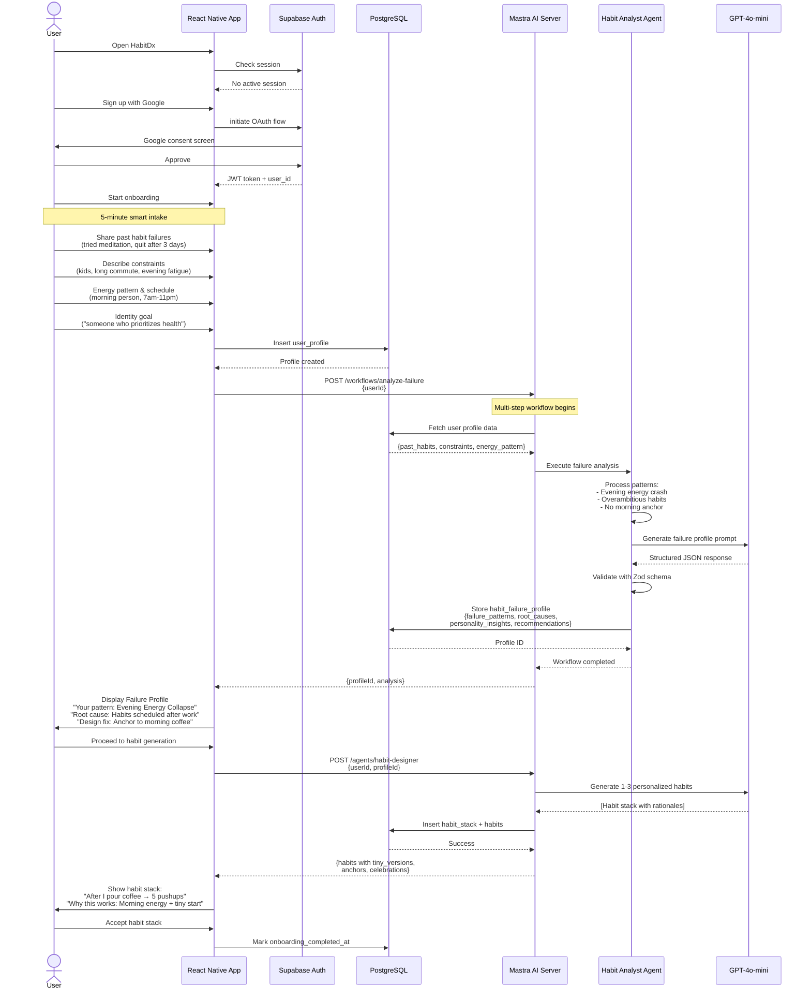
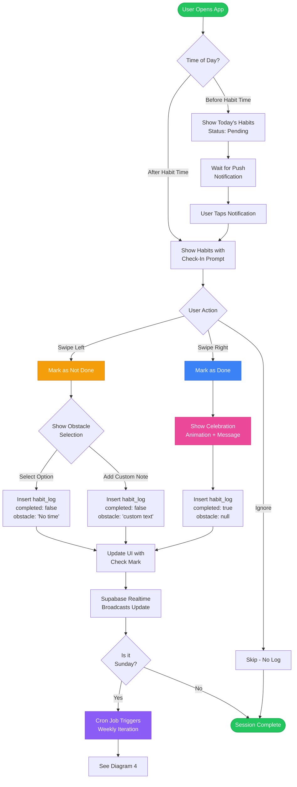
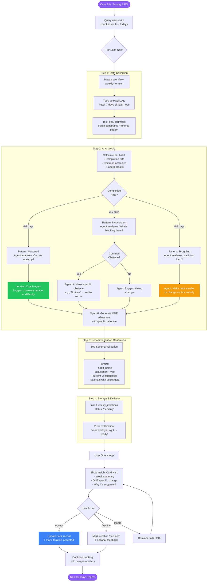
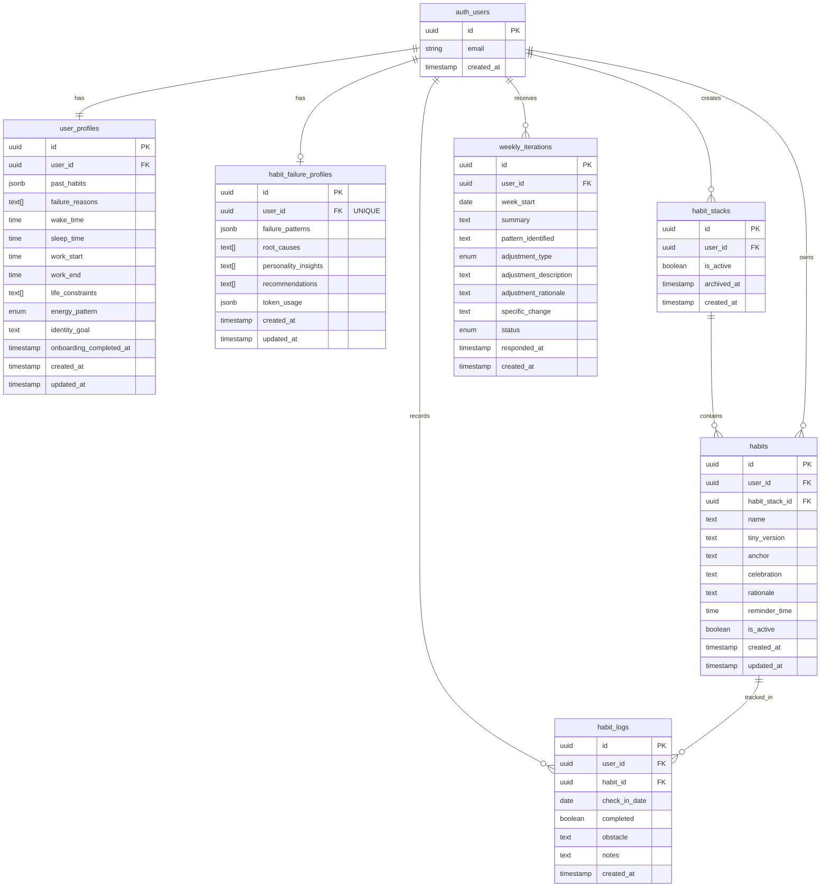
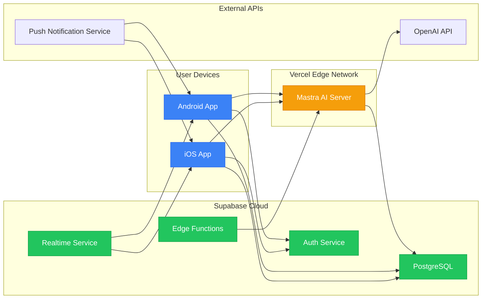

# HabitDx System Architecture Diagrams

This document contains 5 different Mermaid UML diagrams showcasing the architecture, workflows, and interactions within the HabitDx application.

---

## 1. System Architecture Overview

This diagram illustrates the high-level system architecture showing how all components interact - from the React Native mobile app through Supabase backend to the Mastra AI server and external services.

```mermaid
graph TB
    subgraph "Mobile App Layer"
        A[React Native App<br/>Expo SDK]
        A1[Zustand State Management]
        A2[Expo Router Navigation]
        A --> A1
        A --> A2
    end

    subgraph "Backend Services"
        B[Supabase Platform]
        B1[PostgreSQL Database<br/>+ RLS Policies]
        B2[Authentication<br/>Email + Google OAuth]
        B3[Edge Functions<br/>Deno Runtime]
        B4[Realtime Subscriptions]
        B5[Cron Jobs]
        B --> B1
        B --> B2
        B --> B3
        B --> B4
        B --> B5
    end

    subgraph "AI Orchestration Layer"
        C[Mastra AI Server<br/>Node.js/Vercel]
        C1[Agents<br/>Habit Analyst<br/>Iteration Coach<br/>Habit Designer]
        C2[Workflows<br/>Failure Analysis<br/>Weekly Iteration]
        C3[Tools<br/>Database Queries<br/>External APIs]
        C4[Memory<br/>Working Memory<br/>Semantic Recall]
        C --> C1
        C --> C2
        C --> C3
        C --> C4
    end

    subgraph "External Services"
        D[OpenAI API<br/>GPT-4o-mini]
        E[Push Notification<br/>Service]
        F[Analytics<br/>Tracking]
    end

    A -->|Supabase Client| B
    A -->|@mastra/client-js| C
    B3 -->|Invoke Workflows| C
    B5 -->|Weekly Cron| B3
    C -->|AI Requests| D
    C3 -->|Query User Data| B1
    A -->|Schedule Reminders| E
    A -->|Track Events| F

    style A fill:#4f46e5,stroke:#3730a3,color:#fff
    style B fill:#22c55e,stroke:#16a34a,color:#fff
    style C fill:#f59e0b,stroke:#d97706,color:#fff
    style D fill:#ec4899,stroke:#db2777,color:#fff
```

**Key Insights:**

- **Mobile-First Architecture**: React Native with Expo provides cross-platform mobile experience
- **Unified Backend**: Supabase handles authentication, database, edge functions, and real-time updates
- **AI Orchestration**: Mastra server separates AI logic from the main backend, enabling complex multi-step workflows
- **External Dependencies**: Minimal external services keep costs low and architecture simple

---

## 2. User Onboarding & Failure Analysis Flow

This sequence diagram shows the complete user journey from signup through the AI-powered failure profile generation that sets HabitDx apart from generic habit trackers.



**Key Insights:**

- **Personalization from Day 1**: Unlike generic trackers, HabitDx diagnoses failure patterns before suggesting habits
- **Multi-step AI Pipeline**: Workflow orchestration ensures data fetching → analysis → validation → storage happens reliably
- **Transparent AI Reasoning**: Users see _why_ habits are designed for them, building trust
- **Systems Thinking**: Focuses on design problems (timing, energy, anchors) not willpower

---

## 3. Daily Check-In & Data Collection System

This diagram shows the minimal-friction daily check-in system that collects the data necessary for weekly AI iterations.



**Key Insights:**

- **10-Second Check-In**: Simple swipe gestures minimize friction
- **Optional Obstacle Capture**: Users can provide context without being forced
- **Immediate Feedback**: Celebration animations reinforce positive behavior
- **Realtime Sync**: Data updates across devices instantly
- **Automated Weekly Trigger**: Sunday cron job processes all users for iteration

---

## 4. Weekly AI Iteration Engine

This flowchart demonstrates the core value loop - how HabitDx analyzes 7 days of check-in data and delivers ONE specific adjustment using branching AI logic.



**Key Insights:**

- **Data-Driven Decisions**: AI analyzes actual check-in patterns, not generic rules
- **Branching Logic**: Different completion rates trigger different AI reasoning paths
- **One Change Rule**: Never overwhelms users with multiple simultaneous adjustments
- **Iterative Learning**: Each week's data informs the next week's suggestion
- **User Control**: Users can accept or decline, staying in the driver's seat

---

## 5. Database Schema & Relationships

This entity relationship diagram shows the complete database structure with all tables, relationships, and key constraints that power HabitDx.



**Key Schema Insights:**

### Core Tables:

- **user_profiles**: Onboarding intake data that feeds all AI analysis
- **habit_failure_profiles**: AI-generated diagnosis (the app's differentiator)
- **habit_stacks**: Groupings of habits, allowing users to regenerate or archive
- **habits**: Individual habit definitions with tiny versions and anchors
- **habit_logs**: Daily check-in records with obstacle capture
- **weekly_iterations**: AI-generated insights with acceptance tracking

### Important Relationships:

1. **One-to-One**: User → Failure Profile (each user gets one diagnosis)
2. **One-to-Many**: User → Habit Stacks (allows regeneration without losing history)
3. **One-to-Many**: Habit Stack → Habits (typically 1-3 habits per stack)
4. **One-to-Many**: Habit → Logs (one entry per day per habit)
5. **One-to-Many**: User → Weekly Iterations (one insight per week)

### Data Constraints:

- **UNIQUE(habit_id, check_in_date)**: Prevents duplicate check-ins
- **RLS Policies**: All tables have `auth.uid() = user_id` policies for security
- **Enums**: `energy_pattern`, `adjustment_type`, `status` ensure data integrity
- **NOT NULL on critical fields**: Forces complete onboarding data

### Performance Optimizations:

- **Indexes on user_id + date columns**: Fast queries for dashboard and weekly analysis
- **Filtered indexes on is_active**: Only active habits/stacks indexed
- **JSONB fields**: Flexible schema for evolving AI outputs without migrations

---

## System Design Principles

### 1. Mobile-First Architecture

- React Native with Expo enables rapid iteration and cross-platform deployment
- Zustand provides lightweight state management without Redux complexity
- Expo Router simplifies navigation with file-based routing

### 2. AI as a Service Layer

- Mastra AI server separates complex AI orchestration from the main backend
- Workflows provide deterministic multi-step pipelines with validation
- Agents with working memory enable future conversational coaching features
- Tools give AI controlled access to database queries and external APIs

### 3. Data-Driven Personalization

- Rich onboarding data (5 minutes) enables meaningful AI analysis
- Daily check-in obstacle capture provides continuous learning signal
- Weekly iteration creates compounding value through incremental improvements

### 4. Progressive Disclosure

- Users see immediate value (Failure Profile) before committing to daily tracking
- AI reasoning is transparent ("why this works for you")
- One change at a time prevents overwhelming users

### 5. Cost-Effective Scaling

- GPT-4o-mini ($0.15/1M tokens) keeps AI costs under $0.10/user/month
- Supabase free tier supports 50,000 monthly active users
- Edge Functions run only when needed (not always-on servers)
- Vercel free tier hosts Mastra server for MVP validation

---

## Technology Decisions Rationale

| Technology          | Why Chosen                                                | Alternatives Considered                                                     |
| ------------------- | --------------------------------------------------------- | --------------------------------------------------------------------------- |
| React Native + Expo | Cross-platform, fast iteration, large ecosystem           | Flutter (smaller talent pool), Native (2x dev time)                         |
| Supabase            | All-in-one: auth + DB + functions + realtime              | Firebase (vendor lock-in), Pocketbase (too early), AWS Amplify (complexity) |
| PostgreSQL          | Rich querying, JSONB for flexible schema, RLS             | MongoDB (no RLS), MySQL (weaker JSON support)                               |
| Mastra AI           | Type-safe workflows, memory, tool orchestration           | LangChain (less type-safe), OpenAI Assistants (expensive)                   |
| GPT-4o-mini         | 10x cheaper than GPT-4, sufficient for structured outputs | Claude (no OpenAI credit), Llama (hosting complexity)                       |
| Zustand             | Lightweight, TypeScript-first, no boilerplate             | Redux (verbose), Jotai (less mature), Context (performance)                 |
| Expo Router         | File-based, less boilerplate than React Navigation        | React Navigation (more manual setup)                                        |

---

## Deployment Architecture



**Deployment Strategy:**

- **Mobile Apps**: Distributed via App Store and Google Play
- **Mastra Server**: Deployed on Vercel with automatic CI/CD
- **Supabase**: Managed PostgreSQL with automatic backups
- **Edge Functions**: Serverless with automatic scaling
- **OpenAI**: Pay-per-use API with rate limiting

---

## Summary

HabitDx differentiates itself through:

1. **AI-Powered Diagnosis**: Unlike passive trackers, it analyzes _why_ habits fail
2. **Personalized Design**: Habits fit users' actual constraints (energy, schedule, environment)
3. **Weekly Iteration**: One specific adjustment based on real data, not generic advice
4. **Systems Thinking**: Treats failure as a design problem, not a willpower problem
5. **Scalable Architecture**: Built to handle thousands of users with minimal operational overhead

These diagrams showcase how the technical architecture supports the product vision of helping knowledge workers finally build consistent habits through intelligent, personalized iteration.
