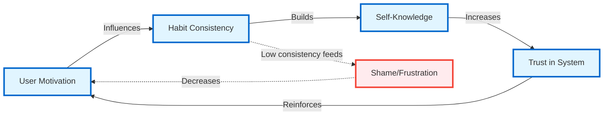
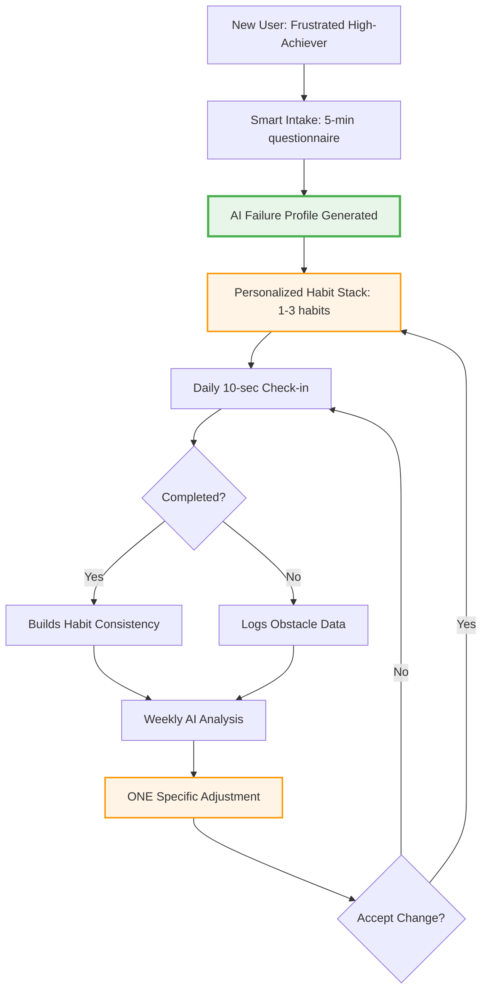
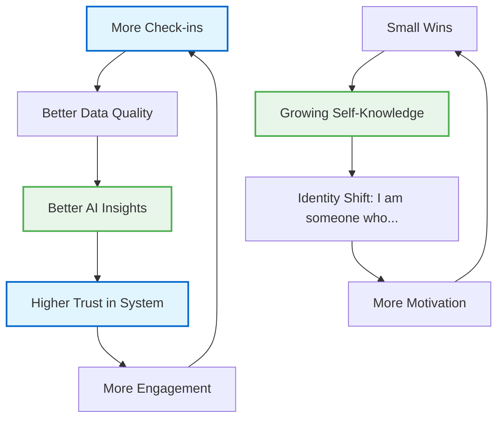
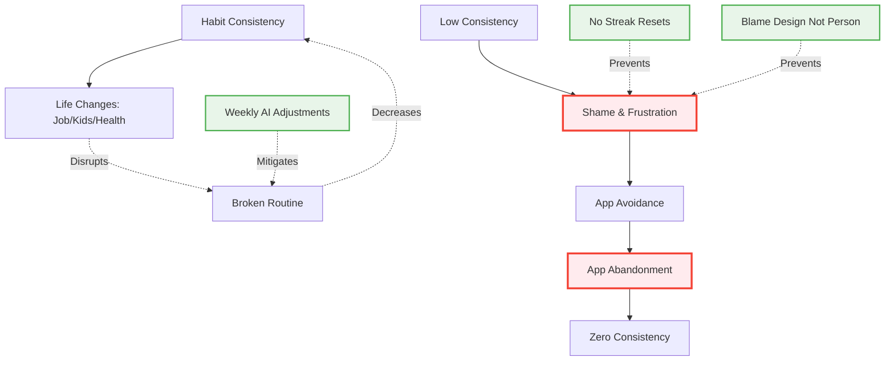
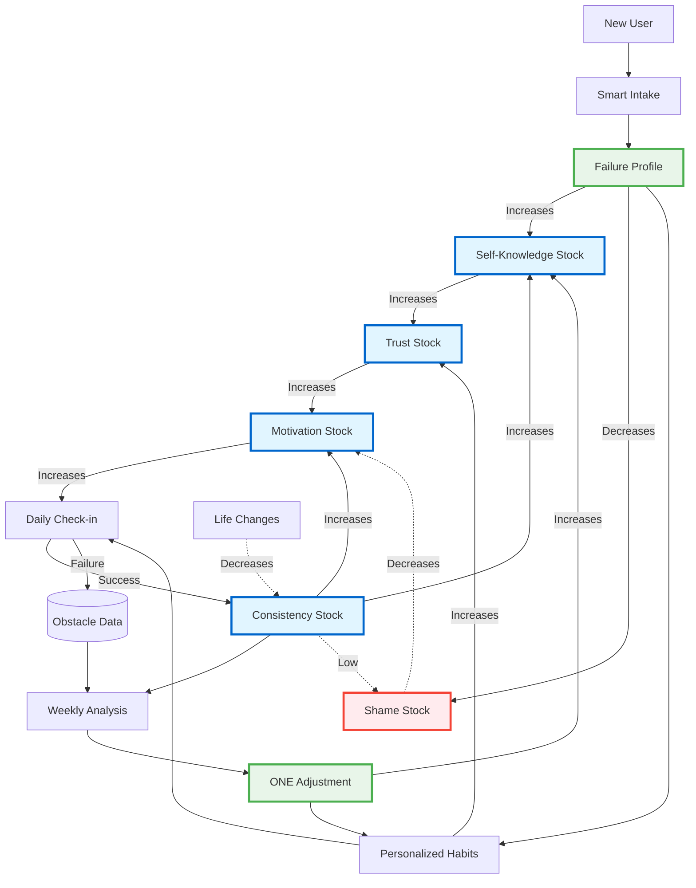

# HabitDx Systems Thinking Diagram

## Based on "Thinking in Systems" by Donella Meadows

---

## Diagram 1: System Stocks (What Accumulates)



## Diagram 2: Core User Journey (Onboarding → Daily Use)



## Diagram 3: Core Value Proposition (What Makes Us Different)

```mermaid
graph TB
    subgraph Traditional Apps
        T1[User] --> T2[Check Boxes]
        T2 --> T3[See Streak Counter]
        T3 --> T4[Break Streak]
        T4 --> T5[Shame & Abandonment]
    end

    subgraph HabitDx System
        H1[User] --> H2[Smart Intake]
        H2 --> H3[Failure Diagnosis]
        H3 --> H4[Designed Habits]
        H4 --> H5[Check-ins with Context]
        H5 --> H6[Pattern Analysis]
        H6 --> H7[Personalized Adjustment]
        H7 --> H4
    end

    style T5 fill:#ffebee,stroke:#f44336,stroke-width:3px
    style H3 fill:#e8f5e9,stroke:#4caf50,stroke-width:3px
    style H7 fill:#e8f5e9,stroke:#4caf50,stroke-width:3px
```



## Diagram 4: Reinforcing Feedback Loops (Virtuous Cycles)



## Diagram 5: Balancing Forces (What We're Fighting)



## Diagram 6: Complete System Overview with Stocks & Flows



---

## System Components Explained

### STOCKS (What Accumulates)

| Stock                    | Initial State                       | Goal State                     | How It Changes                                                           |
| ------------------------ | ----------------------------------- | ------------------------------ | ------------------------------------------------------------------------ |
| **🔋 User Motivation**   | Low (from repeated failures)        | High, sustained                | ↑ Success experiences, insights<br/>↓ Failures, shame, generic advice    |
| **✅ Habit Consistency** | Very low (92% fail rate)            | >70% completion rate           | ↑ Proper habit design, reminders<br/>↓ Life disruptions, poor timing     |
| **🧠 Self-Knowledge**    | Minimal ("I don't know why I fail") | Deep understanding of patterns | ↑ Failure Profile, weekly insights<br/>↓ Generic tracking (no diagnosis) |
| **🤝 Trust in System**   | Low (tried 3+ apps already)         | High (feels personalized)      | ↑ Relevant insights, "it gets me"<br/>↓ Generic advice, ignored context  |
| **😞 Shame/Frustration** | High (years of failure)             | Minimal                        | ↑ Broken streaks, willpower blame<br/>↓ System thinking, understanding   |

### FLOWS (What Changes Stocks)

#### Inflows (Increase Stocks)

- **Smart Intake** → Self-Knowledge: Captures failure patterns
- **Failure Profile** → App Trust: "This app gets me!"
- **Successful Check-in** → User Motivation: Dopamine hit
- **Weekly Insight** → Self-Knowledge: "I struggle Tuesday evenings"
- **Accepted Adjustment** → Habit Consistency: Better design

#### Outflows (Decrease Stocks)

- **Generic Advice** → App Trust: Feels like every other app
- **Broken Streaks** → User Motivation: Shame spiral begins
- **Life Changes** → Habit Consistency: Old system breaks
- **Ignored Context** → App Trust: "This doesn't fit my life"

---

## Feedback Loops

### 🔄 Reinforcing Loop 1: "Insight Flywheel" (Virtuous Cycle)

```
More Check-ins → Better Data → Better Insights → Higher Trust →
More Engagement → More Check-ins (↑↑↑)
```

**Why it works:** Each week of data makes AI smarter about the user's patterns. Better insights = more trust = more usage = richer data.

**System Leverage:** This is the CORE DIFFERENTIATOR. Traditional apps lack this loop.

---

### 🔄 Reinforcing Loop 2: "Identity Shift" (Virtuous Cycle)

```
Small Wins → Growing Self-Knowledge → Identity Formation →
More Motivation → Small Wins (↑↑↑)
```

**Why it works:** Understanding _why_ you failed shifts from "I'm weak" to "My evening energy crashes." System thinking replaces self-blame.

**System Leverage:** Failure Profile is the key intervention point.

---

### ⚠️ Balancing Loop 1: "Life Entropy" (Resistance)

```
Habit Consistency → Life Changes → Disrupted Routine →
Lower Consistency (↓↓↓)
```

**System Reality:** Life always adds entropy. Kids get sick, jobs change, routines break.

**Current Mitigation:** Weekly adjustments adapt to new patterns.

**Missing Feature:** Proactive constraint updates (see below).

---

### ⚠️ Balancing Loop 2: "Shame Spiral" (Vicious Cycle WE'RE FIGHTING)

```
Low Consistency → Shame → Avoidance → App Abandonment →
Zero Consistency (↓↓↓)
```

**Traditional App Problem:** Streak counters + no diagnosis = shame when broken.

**HabitDx Solution:**

- "Don't miss twice" philosophy
- No judgment, only data
- Blame the design, not the person

---

## Delays in the System

| Delay                            | Duration   | Impact                             | Mitigation Strategy                               |
| -------------------------------- | ---------- | ---------------------------------- | ------------------------------------------------- |
| **Onboarding → First Insight**   | 7 days     | User may churn before seeing value | Show Failure Profile immediately                  |
| **Adjustment → Behavior Change** | 3-7 days   | User needs time to test changes    | Set expectations in UI                            |
| **Pattern Recognition**          | 2-4 weeks  | Not enough data for deep insights  | Combine AI analysis with research-backed defaults |
| **Habit Formation**              | 21-66 days | Delayed gratification              | Weekly micro-wins to maintain motivation          |

**System Insight:** The 7-day delay to first insight is CRITICAL. Users need value before then.

---

## Core Value Proposition in Systems Context

```
┌─────────────────────────────────────────────────────────────┐
│  TRADITIONAL APPS: Passive Tracking (No Diagnosis)          │
│                                                             │
│  User → Check Boxes → See Streak → Break Streak → Shame   │
│         (No learning, no adaptation, no why)                │
└─────────────────────────────────────────────────────────────┘

┌─────────────────────────────────────────────────────────────┐
│  HABITDX: Active Diagnosis + Personalized Iteration         │
│                                                             │
│  User → Smart Intake → Failure Diagnosis → Designed Habits │
│         → Check-ins → Pattern Analysis → ONE Adjustment    │
│         → Updated Design → Repeat                           │
│                                                             │
│  (Learning compounds, system adapts, shame → insight)      │
└─────────────────────────────────────────────────────────────┘
```

**System Differentiation:**

1. **Input:** Not just "what" but "why" habits failed
2. **Processing:** AI diagnosis, not generic templates
3. **Output:** Personalized adjustments, not motivational quotes
4. **Feedback:** Weekly iteration based on YOUR data

---

## Missing Features: Systems Analysis

Based on systems thinking principles, here are features that would strengthen the system:

### 🔴 CRITICAL GAPS (High Leverage Points)

#### 1. **Proactive Constraint Update Prompts**

**System Problem:** Life Entropy balancing loop breaks habits, but user doesn't update system.

**Current State:** User must manually remember to update constraints.

**Better Design:**

- AI detects pattern disruption: "Your Tuesday habits have failed 3 weeks straight. Did something change?"
- Prompt user to update constraints
- Auto-regenerate habits if major change detected

**Why it matters:** Prevents abandonment when life changes. Current system assumes static life.

---

#### 2. **Pre-Failure Pattern Detection**

**System Problem:** Weekly insights are REACTIVE (after failure), not PREDICTIVE.

**Current State:** Analyze what went wrong last week.

**Better Design:**

- Track real-time patterns during the week
- If user misses habit 2 days in a row: "Heads up: You're at risk of missing [habit] again. Want to adjust now instead of waiting for Sunday?"
- Offer micro-adjustment before the week is over

**Why it matters:** Interrupts Shame Spiral loop earlier. Prevention > cure.

---

#### 3. **Social Accountability Opt-in**

**System Problem:** Motivation stock depletes in isolation. No external reinforcement.

**Current State:** Fully solo experience.

**Better Design:**

- Optional: Connect with ONE accountability partner
- They don't see your habits, just: "Blake checked in today ✓"
- You get same ping about them
- Low-pressure, no comparison, just presence

**Why it matters:** Adds reinforcing loop of social commitment without shame of public leaderboards.

---

### 🟡 IMPORTANT ENHANCEMENTS (Medium Leverage)

#### 4. **Habit Confidence Score**

**System Problem:** User doesn't know which habits are "working" vs "need adjustment" between weekly insights.

**Better Design:**

- Real-time confidence score per habit (0-100%)
- Based on: completion rate, obstacle patterns, time-of-day consistency
- Visual indicator: 🟢 Strong (>80%), 🟡 Shaky (50-80%), 🔴 Struggling (<50%)
- "Your 'morning stretch' is at 45% confidence. Want to adjust it now?"

**Why it matters:** Makes system state visible. Users can intervene before weekly cycle.

---

#### 5. **Insight History with Impact Tracking**

**System Problem:** User can't see if past adjustments actually worked (no closed loop).

**Current State (P1):** View past insights.

**Better Design:**

- Show adjustment timeline
- Before/after completion rates
- "When we moved your habit to after coffee (Week 3), your completion rate went from 40% → 75%"

**Why it matters:** Reinforces Trust in System stock. Proof that iteration works.

---

#### 6. **Energy/Context Check-in**

**System Problem:** We track habit completion but not the CONTEXT (energy, stress, sleep).

**Current State:** Optional obstacle note only on failure.

**Better Design:**

- Daily micro-check-in: "How's your energy today? 😴😐⚡"
- AI correlates energy with habit success
- Weekly insight: "You complete habits 2x more on high-energy days. Let's design a low-energy version."

**Why it matters:** Adds crucial variable to the system. Habits don't exist in vacuum.

---

### 🟢 NICE-TO-HAVE (Lower Leverage but Valuable)

#### 7. **Habit Pause/Resume Flow**

**System Problem:** When life crisis hits (sick, travel, major event), rigid system breaks.

**Better Design:**

- "Pause habits for X days" option
- No shame, no broken streak
- Graceful degradation instead of complete failure
- "Resume when ready"

**Why it matters:** Prevents complete abandonment during temporary disruptions.

---

#### 8. **Celebration Reminders**

**System Problem:** Users do tiny habits but forget to celebrate (lose dopamine reinforcement).

**Better Design:**

- When user marks complete, app shows their chosen celebration
- "Don't forget to [celebration text]!"
- Optional: Confetti animation

**Why it matters:** Strengthens User Motivation inflow at crucial moment.

---

#### 9. **Failure Pattern Library**

**System Problem:** Each user's Failure Profile is isolated. No network effects.

**Better Design (PRIVACY-SAFE):**

- Anonymized failure pattern database
- "47% of evening-energy users struggle with morning habits"
- "Users who anchor to coffee have 23% higher success"
- Show user how they compare (optional)

**Why it matters:** Leverages collective intelligence. Reduces AI cold-start problem.

---

## System Leverage Points (Priority Order)

According to Donella Meadows, the most powerful places to intervene in a system are:

1. **⭐ PARADIGM (Highest Leverage):**
   - Current: "Blame willpower" → "Blame design"
   - HabitDx already addresses this! Failure Profile reframes the mental model.

2. **GOALS:**
   - Traditional apps: Maximize streaks
   - HabitDx: Maximize self-knowledge + habit-life fit
   - ✅ Already differentiated

3. **FEEDBACK LOOPS:**
   - ADD: Pre-failure detection (#2 above)
   - ADD: Real-time confidence scores (#4 above)
   - ADD: Social accountability (#3 above)

4. **DELAYS:**
   - REDUCE: 7-day delay to first insight (show Failure Profile immediately)
   - ✅ Already doing this

5. **INFORMATION FLOWS:**
   - ADD: Proactive constraint updates (#1 above)
   - ADD: Energy/context check-ins (#6 above)

---

## Recommended Implementation Priority

Based on systems leverage and current MVP gaps:

### Phase 1 (MVP Complete)

✅ Already defined in PRD

### Phase 2 (v1.1) - HIGH LEVERAGE ADDITIONS

1. **Proactive Constraint Update Prompts** (Critical Gap #1)
2. **Habit Confidence Score** (Real-time feedback)
3. **Insight History with Impact Tracking** (Closes the loop)

### Phase 3 (v1.2) - RETENTION BOOSTERS

4. **Pre-Failure Pattern Detection** (Critical Gap #2)
5. **Energy/Context Check-in** (Better data)
6. **Habit Pause/Resume Flow** (Graceful degradation)

### Phase 4 (v2.0) - NETWORK EFFECTS

7. **Social Accountability Opt-in** (Critical Gap #3)
8. **Failure Pattern Library** (Collective intelligence)
9. **Celebration Reminders** (Dopamine reinforcement)

---

## System Health Metrics

To monitor system health beyond product metrics:

| System Stock      | Health Indicator                                 | Target |
| ----------------- | ------------------------------------------------ | ------ |
| Self-Knowledge    | % users who can articulate their failure pattern | >80%   |
| App Trust         | % who say "app gets me" in surveys               | >70%   |
| User Motivation   | Week-over-week retention                         | >85%   |
| Habit Consistency | Avg completion rate                              | >65%   |
| Shame Level       | % who cite "shame" as reason for leaving         | <10%   |

---

## Conclusion: Why This System Works

HabitDx succeeds where others fail because it treats habit formation as a **complex adaptive system**, not a simple checklist:

1. **Diagnosis before prescription** (Failure Profile)
2. **Personalization from constraints** (not generic templates)
3. **Continuous adaptation** (weekly iteration)
4. **Blame the design, not the person** (paradigm shift)
5. **Short feedback loops** (7 days, not months)

The missing features identified above would strengthen:

- **Resilience** (proactive updates, pause/resume)
- **Responsiveness** (pre-failure detection, confidence scores)
- **Reinforcement** (social accountability, celebrations)

But the core system is sound. The MVP already addresses the highest-leverage intervention: **changing the paradigm from willpower-blame to design-thinking.**

---

**Created:** 2026-02-09  
**Framework:** "Thinking in Systems" by Donella Meadows  
**Purpose:** Map HabitDx user experience as interconnected stocks, flows, and feedback loops
