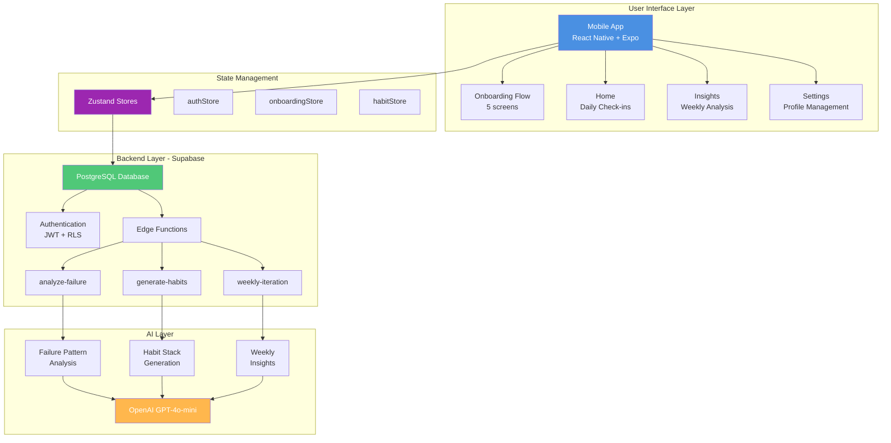
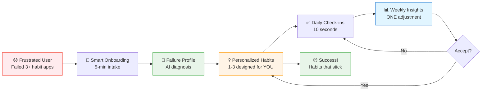
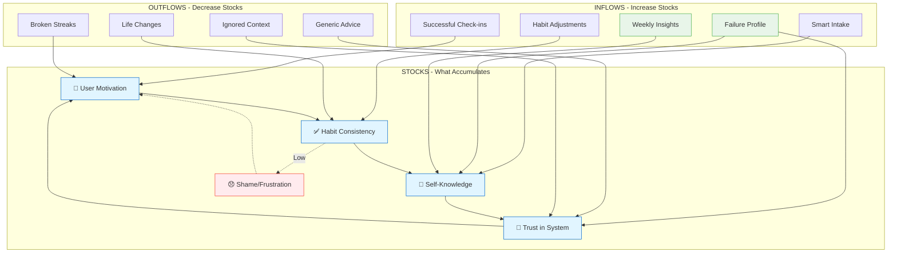
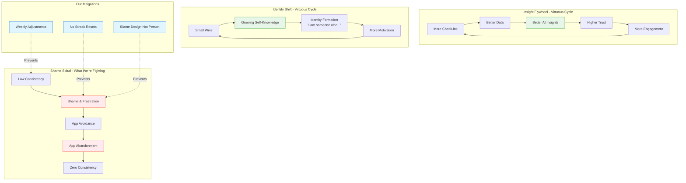
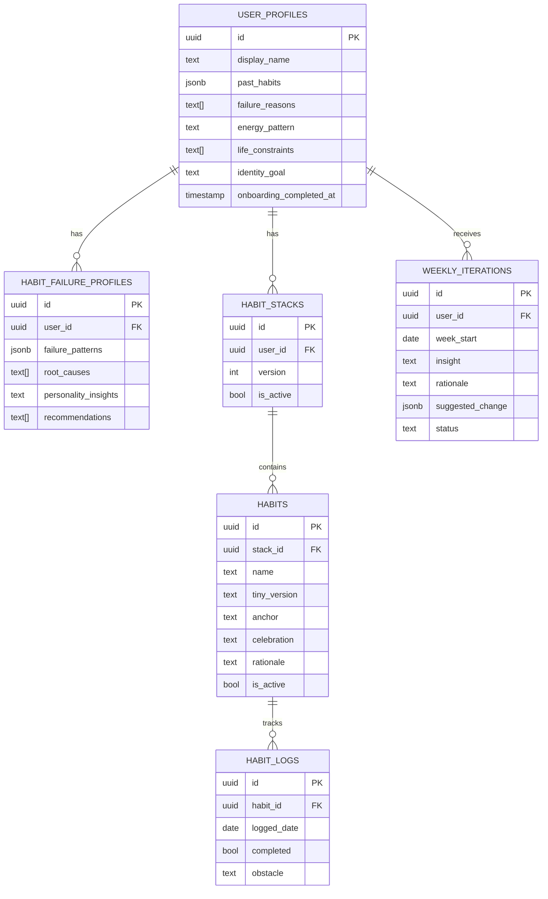
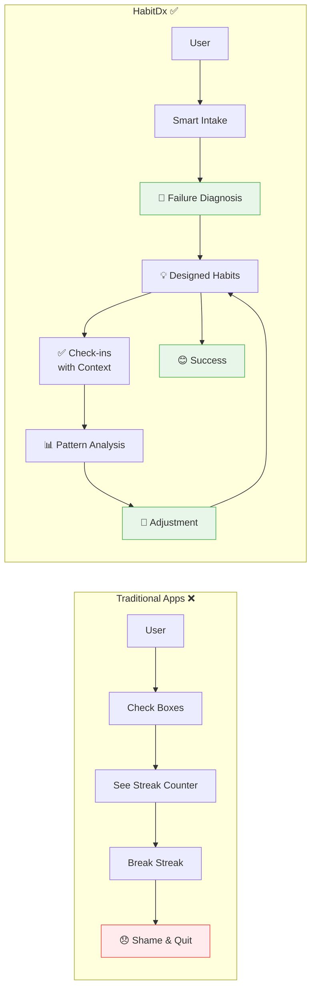
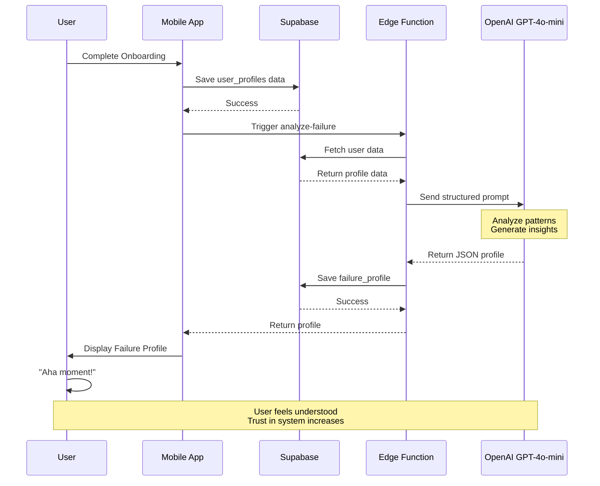
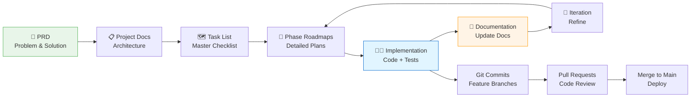
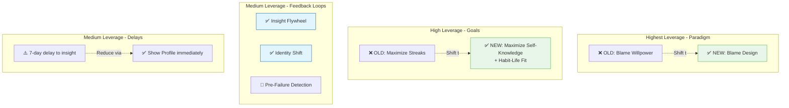
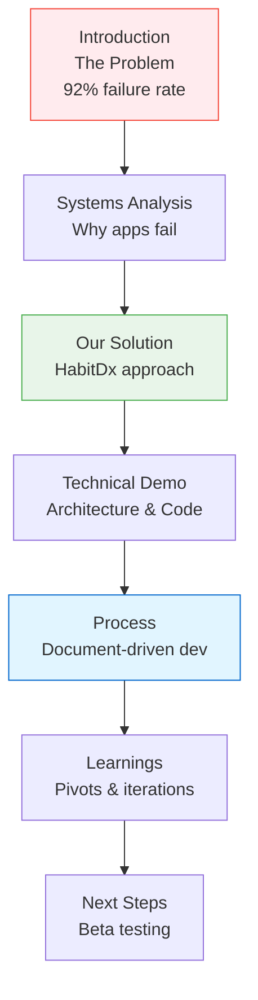

# HabitDx System Diagrams - Presentation Version

**Purpose:** Visual diagrams for midterm presentation  
**Date:** February 16, 2026

---

## 1. High-Level System Architecture

---

## 2. User Journey Flow (Core Value Proposition)

---

## 3. System Stocks & Flows (Systems Thinking)

---

## 4. Core Feedback Loops

---

## 5. Database Schema (Simplified)

---

## 6. HabitDx vs Traditional Apps

---

## 7. AI Integration Flow

---

## 8. Development Process Flow

---

## 9. Key Leverage Points (Systems Thinking)

---

## 10. Presentation Flow Diagram

---

## Instructions for Presentation

### Diagram 1: System Architecture

**Use for:** Technical overview  
**Key point:** "All-in-one stack: React Native + Supabase + OpenAI"  
**Time:** 2 minutes

### Diagram 2: User Journey

**Use for:** Product walkthrough  
**Key point:** "From frustration to success in 5 steps"  
**Time:** 3 minutes

### Diagram 3: System Stocks & Flows

**Use for:** Systems thinking demonstration  
**Key point:** "We designed for behavior change, not just tracking"  
**Time:** 3 minutes

### Diagram 4: Feedback Loops

**Use for:** Why HabitDx works  
**Key point:** "Two virtuous cycles + breaking the shame spiral"  
**Time:** 2 minutes

### Diagram 5: Database Schema

**Use for:** Technical depth  
**Key point:** "Schema designed for personalization"  
**Time:** 1 minute

### Diagram 6: HabitDx vs Traditional

**Use for:** Differentiation  
**Key point:** "Not just tracking, but diagnosis and iteration"  
**Time:** 2 minutes

### Diagram 7: AI Integration

**Use for:** AI augmentation demo  
**Key point:** "AI reads user data, generates personalized insights"  
**Time:** 2 minutes

### Diagram 8: Development Process

**Use for:** Process demonstration  
**Key point:** "Document-driven, phase-by-phase, iterative"  
**Time:** 2 minutes

---

## How to Use These Diagrams

### Option 1: Render in Presentation Tool

1. Copy Mermaid code
2. Use Mermaid Live Editor (https://mermaid.live)
3. Export as PNG/SVG
4. Import into PowerPoint/Keynote/Google Slides

### Option 2: Use in Documentation

- Keep in Markdown for README, PRD, Architecture docs
- Renders automatically in GitHub, GitLab, Notion

### Option 3: Interactive Demo

- Use Mermaid.js live rendering in browser
- Walk through each diagram interactively

---

## Presentation Talking Points

### For Casey (Technical Process):

- **Diagram 8 (Development Process):** "We followed PRD → Plan → Roadmap → Implementation"
- **Show git log:** "Phase-by-phase commits with meaningful messages"
- **Show logger.ts:** "Structured logging for AI-assisted debugging"
- **Run test scripts:** "3 CLI test suites covering auth and database"

### For Jason (Product & System Design):

- **Diagram 3 (Stocks & Flows):** "Applied Donella Meadows framework"
- **Diagram 4 (Feedback Loops):** "Identified leverage points"
- **Show PRD falsifiability section:** "Tried to prove ourselves wrong"
- **Show pivot_plan.md:** "6 scenarios with triggers and actions"
- **Show user_research.md:** "Validated problem before building"

### For Guest (Presentation Quality):

- **Diagram 2 (User Journey):** Clear, simple story
- **Diagram 6 (vs Traditional):** Strong differentiation
- **Visuals:** Clean, professional, color-coded
- **Structure:** Logical flow from problem → solution → process

---

**Created:** February 16, 2026  
**For:** Midterm Presentation  
**Export formats:** Mermaid → PNG/SVG for slides
